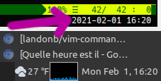

# vim-command-line-clock

An answer to the age-old question after hiding the macOS menu bar,

[*Quelle heure est il?*](https://www.google.com/search?q=Quelle+heure+est+il)

## Introduction

This plugin shows the date and time of day in the Vim command window.

The author finds this useful on macOS, because I like to hide the
macOS menu bar, which is normally where you'd see the clock.

### Requirements

This plug-in requires Vim v8.0 or greater, to take advantage of timers.

## Usage

Nothing. If this plugin is loaded, it'll show a clock in the command window.

For example, here's the lower-right hand corner of Vim running on
Linux Mint MATE. The arrow points to the clock that shows up in the
Vim command window:



Note that the clock will be temporarily hidden when other messages
are printed to the command window. (E.g., type ``:echo "hello"`` and
the clock will disappear while you're typing the command, and for a
number of seconds after running the command, while the echo message
is displayed.)

## See Also

If you'd like to show a clock in the title bar, see a similar plugin:
[vim-title-bar-time-of-day](https://www.github.com/landonb/vim-title-bar-time-of-day)

## Options

To set an option, include a line like the following in your `~/.vimrc`:

  ```
  let g:CommandLineClockDisabled = 1
  ```

The following options are available:

- `g:CommandLineClockDisabled` — Boolean value; either 0 or 1 (default: 0).

  Set this variable truthy to disable the plugin.

- `g:CommandLineClockRepeatTime` — Non-negative integer value (default: 101).

  Determines how often to run the timer that updates the clock (in milliseconds).

- `g:CommandLineClockBackoffMultiplier` - (default: 50).

  How long to wait after a message is detected in the command window
  before repainting the clock (and overwriting the message). The length
  of time is this multiplier multiplied by the repeat time (e.g., 101 * 50
  = 5,050 msec.). This feature gives the user time to see (and read) whatever
  message was printed to the command window, before the clock is repainted.

## Installation

Installation is easy using the packages feature (see ``:help packages``).

If you want the plugin to load automatically on Vim startup,
use a ``start/`` directory, e.g.,

  ```shell
  mkdir -p ~/.vim/pack/landonb/start
  ```

And then clone the project to that path:

  ```shell
  cd ~/.vim/pack/landonb/start
  git clone https://github.com/landonb/vim-command-line-clock.git
  ```

If you want to test the package first, make it optional instead
(see ``:help pack-add``):

  ```shell
  mkdir -p ~/.vim/pack/landonb/opt
  cd ~/.vim/pack/landonb/opt
  git clone https://github.com/landonb/vim-command-line-clock.git

  " When ready, load the [opt]ional plugin (or is it [opt]-in?).
  :packadd! vim-command-line-clock
  ```

To build the help, ensure the plugin is loaded, and then
run the following command just one time from within Vim:

  ```shell
  :Helptags
  ```

Or, you can build the help from the terminal instead. Run:

  ```shell
  vim -u NONE -c "helptags vim-command-line-clock/doc" -c q
  ```

And then to view the help from within Vim, run:

  ```shell
  :help vim-command-line-clock
  ```

Enjoy!

